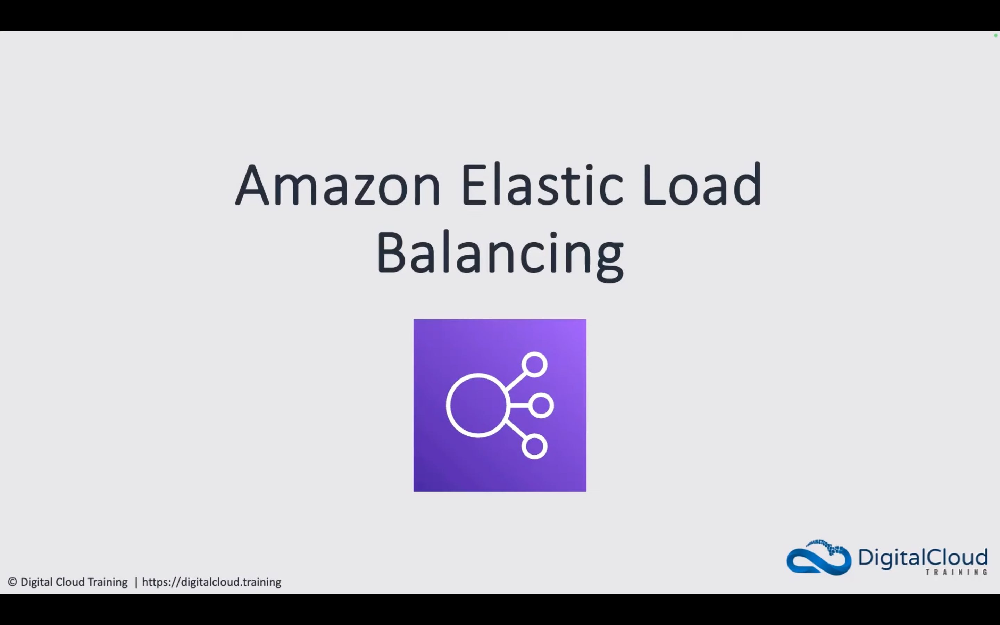

-   

<a href="https://www.youtube.com/watch?v=Wjc_ka1W54g&list=PLO95rE9ahzRs0QMA8qtIAstWFo4X4gHtH&index=1">Intro to AWS Elastic Load Balancing (ELB)</a>

    

    

    

    

    

    

    

    

    

---

-   

<a href="https://www.youtube.com/watch?v=YDBRhqGHhUA&list=PLO95rE9ahzRs0QMA8qtIAstWFo4X4gHtH&index=10">AWS ALB and NLB Access Control and SSL/TLS</a>

    

    

    

    

    

    

    

    

    

---

-   

<a href="">Securing AWS Load Balancers with SSL/TLS - Hands-on</a>

    -   Utilize CloudFormation to provision infrustracture.

    -   

---

-   

<a href="">Screenshots</a>

    

