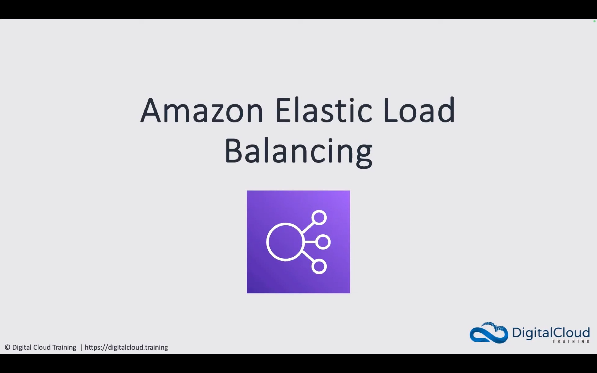

-   [AWS Elastic Load Balancing - How it Works](https://www.youtube.com/watch?v=Wjc_ka1W54g&list=PLO95rE9ahzRs0QMA8qtIAstWFo4X4gHtH&index=1)

-   [AWS Application Load Balancer (ALB) and Network Load Balancer (NLB) Access Control and SSL/TLS](https://www.youtube.com/watch?v=YDBRhqGHhUA&list=PLO95rE9ahzRs0QMA8qtIAstWFo4X4gHtH&index=10)

