-   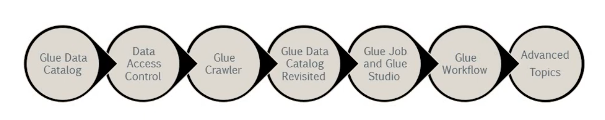

<a href="https://www.youtube.com/watch?v=7U8G3DxTSaU&list=PL8RIJKpVAN1euv-WAoggrdI_wX3zeb9uR&index=2">Introduction to Data Catalog in AWS Lake Formation</a>

-   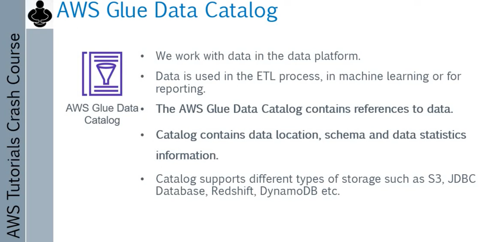
-   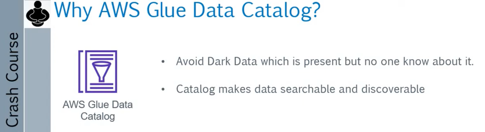
-   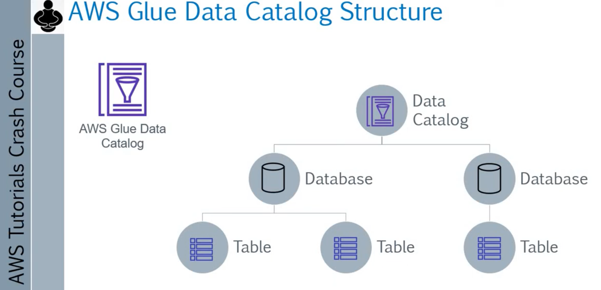
-   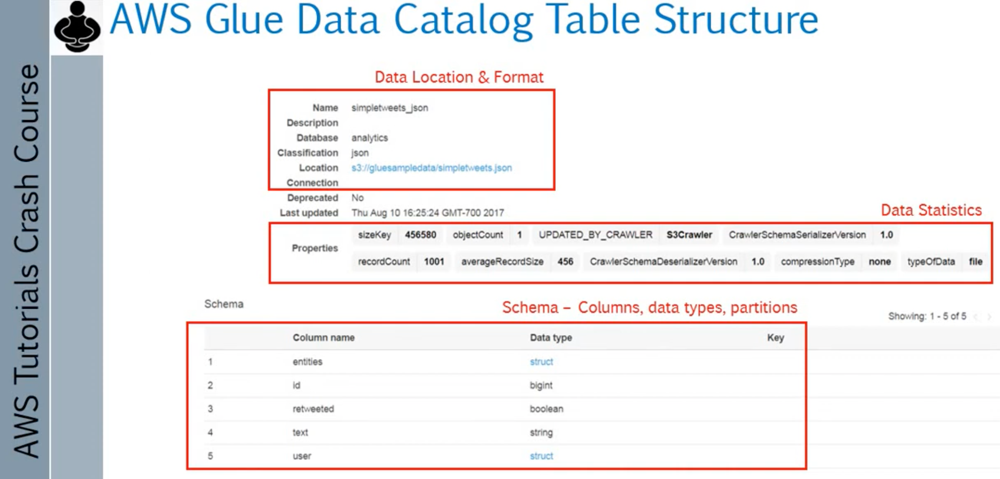
-   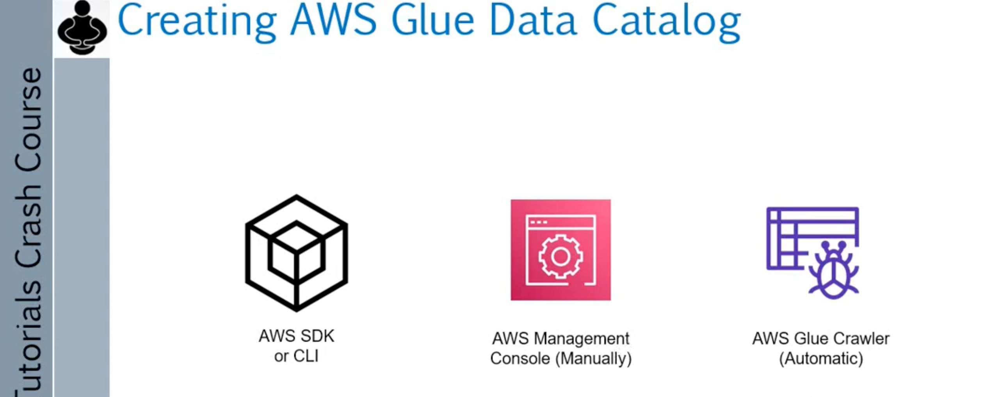
-   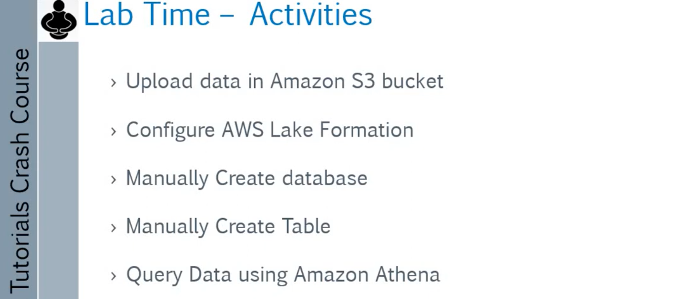

-   **Overview**

    -   `Purpose`: Demonstrate creation and configuration of a Data Catalog in AWS Lake Formation.
    -   `Key Activities`:
        -   Creating data in an S3 bucket.
        -   Cataloging the data manually in AWS Glue and Lake Formation.
        -   Querying the data using Amazon Athena.

-   **Initial Setup**

    -   `AWS Management Console`: Logged in to the us-east region.
    -   `S3 Bucket Creation`:
        -   Create S3 bucket named "Dojo glue lake 01".
        -   Create folders within the bucket:
            -   `customers` for data files.
            -   `scripts` for future use.
            -   `athena` for Athena query results.

-   **Data Preparation**

    -   `Upload Data`:
        -   Upload `customers.csv` file to the `customers` folder in the S3 bucket.

Verify file contents using S3 Select to ensure data structure is correct (customer ID, name, email, territory).

#### Configuring Lake Formation

-   **Administrator Setup**

    -   `Initial Configuration`:
        -   Add self as an administrator in Lake Formation.
    -   `Data Lake Location`:
        -   Register top-level S3 bucket location "Dojo Blue Lake 01".

-   **Database and Table Creation**

    -   `Create Database`:

        -   `Name`: DojoDatabase
        -   `Location`: Same top-level S3 bucket.
        -   Disable IAM-based access control for Lake Formation security.

    -   `Create Table`:
        -   `Name`: customers
        -   `Database`: DojoDatabase
        -   `Data Location`: customers folder in the S3 bucket.
        -   `Schema`:
            -   customer_id (integer)
            -   customer_name (string)
            -   customer_email (string)
            -   territory (string)

-   **Permissions**

    -   `Grant Permissions`:
        -   Grant self (AWS user account) full access to the newly created table.

#### Querying Data with Amazon Athena

-   **Athena Setup**

    -   `Configuration`:
        -   Set S3 bucket location for Athena query results (Athena folder in the S3 bucket).
    -   `Query Execution`:
        -   Preview the customers table data using Athena.

---

Lake Formation Data Access Control

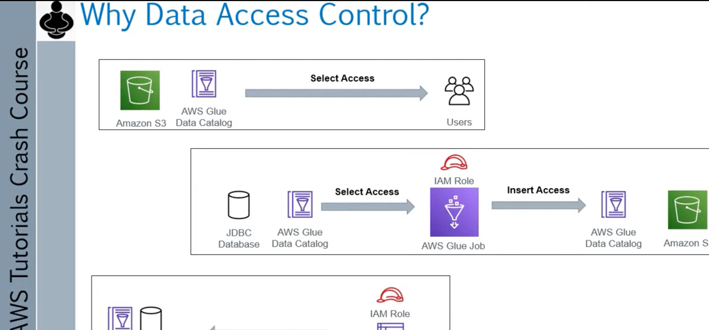
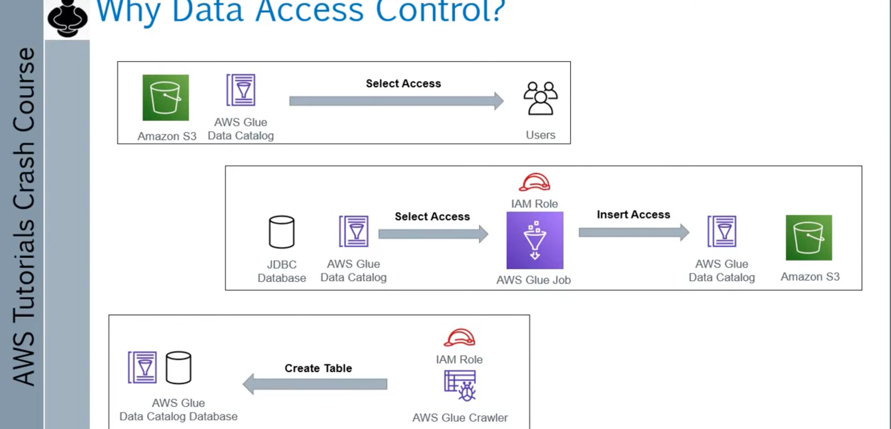
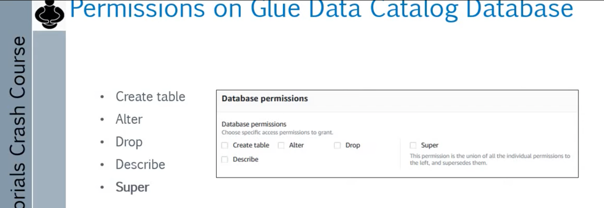
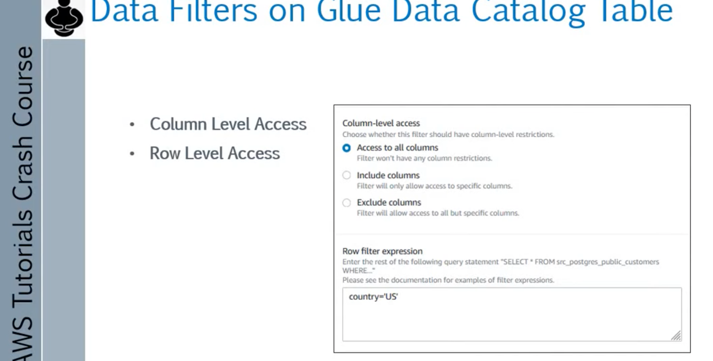
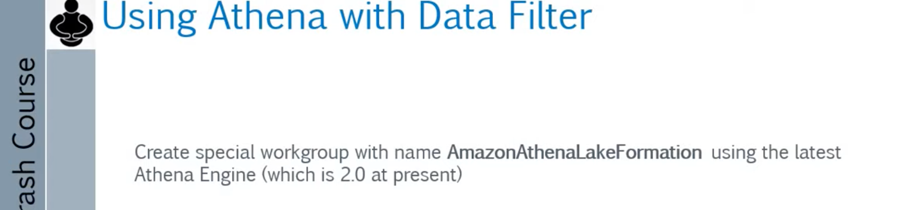
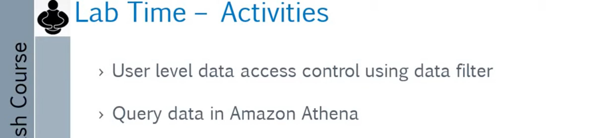

#### Current Module: Data Access Control

Importance of Data Access Control: - Essential before discussing crawlers, jobs, and workflows - Jobs and crawlers require specific permissions to function - Ensures appropriate permissions are set before using other features

#### Examples of Data Access Needs

-   `Example 1`:
    -   Data in S3 bucket
    -   Users need Select Access to query data
-   `Example 2`:
    -   Glue job reading from JDBC endpoint and writing to S3
    -   Requires Select access on the source and Insert access on the target
-   `Example 3`:
    -   Creating a table in Glue database
    -   Requires CREATE TABLE permission

#### Permissions Overview

-   **Database Level Permissions**:
    -   Create Table
    -   Alter Database
    -   Drop Database
    -   Describe Database
    -   Super Permission (all permissions)
-   **Table Level Permissions**:
    -   Select (query data)
    -   Insert
    -   Delete
    -   Describe (fetch table info)
    -   Alter Table
    -   Drop Table
    -   Super Permission (all permissions)
-   **Column and Row Level Permissions**:
    -   Managed via Data Filters
    -   Restrict access to specific columns or rows

#### Data Filters and Access Control

-   **Data Filters**:
    -   New feature in AWS Lake Formation
    -   Can include/exclude certain columns and rows
    -   Use filter criteria for row-level access control
-   **Athena Workgroup Configuration**:
    -   Create a specific workgroup named AmazonAthenaLakeFormation
    -   Necessary for querying data with data filters

#### Practical Implementation

-   **Create IAM Users**:
    -   NA User
    -   EMEA User
-   **Set Permissions using Data Filters**:
    -   `NA Filter`:
        -   `Columns`: Customer Name, Territory
        -   `Row`: Territory = North America
    -   `EMEA Filter`:
        -   `Columns`: Customer Email, Territory
        -   `Row`: Territory = EMEA
-   **Assign Data Filters to Users**:
    -   `NA User`: NA Filter, Select Permission
    -   `EMEA User`: EMEA Filter, Select Permission

#### Testing Access Control

-   **Login as NA User**:

    -   Configure Athena settings
    -   Verify restricted access to columns and rows
    -   `Expected Result`:
        -   `Columns`: Customer Name, Territory
        -   `Rows`: Territory = North America

-   **Login as EMEA User**:

    -   Configure Athena settings
    -   Verify restricted access to columns and rows
    -   `Expected Result`:
        -   `Columns`: Customer Email, Territory
        -   `Rows`: Territory = EMEA

---

Glue Crawler

-   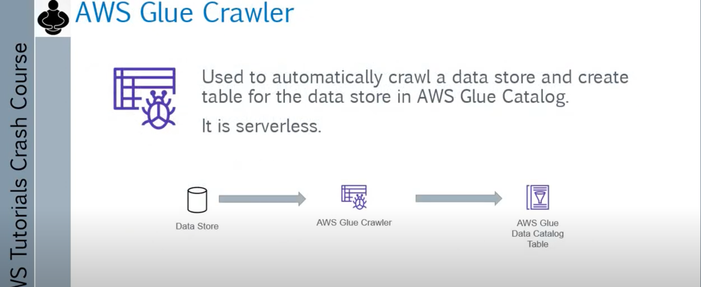
-   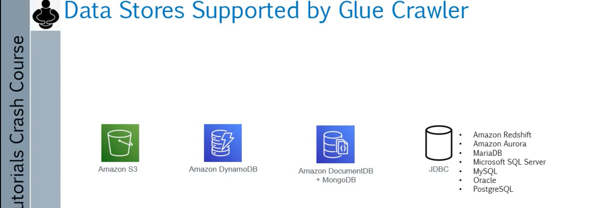
-   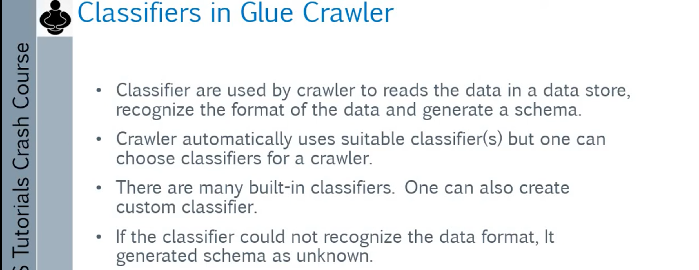
-   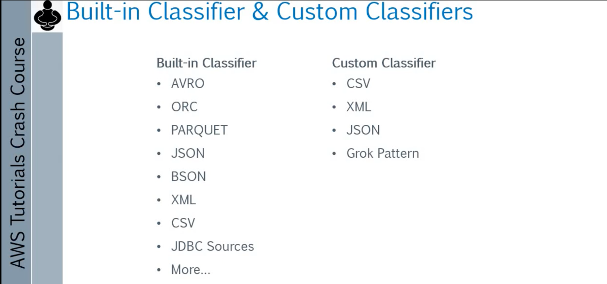
-   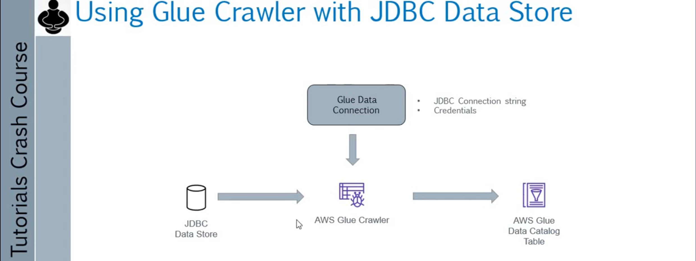
-   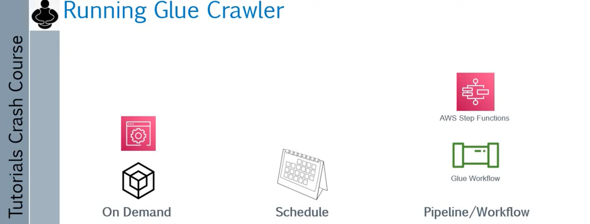

-   **Purpose**
    -   Automatically create catalog for data platform
    -   Manage large number of data sets automatically
    -   Integrate cataloging into data pipelines
-   **Features**
    -   Serverless technology
    -   Pay-per-use pricing
-   **Supported Data Stores**
    -   S3 buckets
    -   DynamoDB
    -   DocumentDB
    -   JDBC endpoints
        -   SQL Server
        -   Oracle
        -   MariaDB
        -   Aurora
        -   Amazon Redshift
-   **Schema Identification**
    -   Uses Classifiers
    -   Supports CSV, JSON, XML, Parquet, etc.
    -   Built-in Classifiers
        -   Avro
        -   ORC
        -   Parquet
        -   JSON
        -   JDBC data sources
    -   Custom Classifiers
        -   Needed if built-in classifiers are insufficient
        -   Can be configured for CSV, XML, JSON
        -   Grok pattern for generic classification
-   **Data Connection**
    -   Required for JDBC data stores
    -   Provides JDBC connection string and credentials
    -   Configures login, password, and optional filter criteria
-   **Running Glue Crawler**
    -   On-demand via AWS Console
    -   API call via CLI or SDK
    -   Scheduled runs
    -   Integrated into ETL pipelines or workflows

#### Creating and Using AWS Glue Crawler

-   **Setup**

    -   Create IAM role for Glue
    -   Assign AWS Glue Service Policy to the role

-   **Lake Formation Permissions**

    -   Grant permissions to Glue role on database
    -   Allow Create Table permissions

-   **RDS Database**

    -   Create and connect to an RDS instance
    -   Create table and insert data using SQL script

-   **Glue Data Connection**

    -   Add JDBC connection in Glue Console
    -   Test the connection to ensure proper configuration

-   **Configuring Glue Crawler**

    -   Create a new crawler in Glue Console
    -   Use data connection to connect to RDS database
    -   Set include path for database objects
    -   Assign IAM role with appropriate permissions
    -   Run crawler to catalog database table

-   **Verification**
    -   Check cataloged tables in Glue Console
    -   Verify schema in Lake Formation

---

Glue Data Catalog Revisited

-   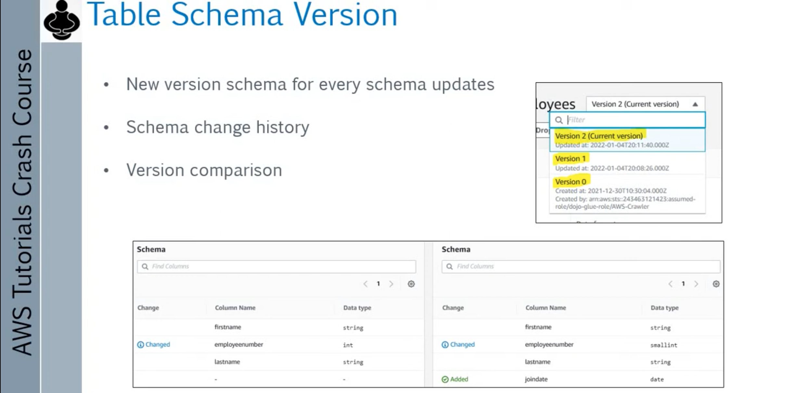
-   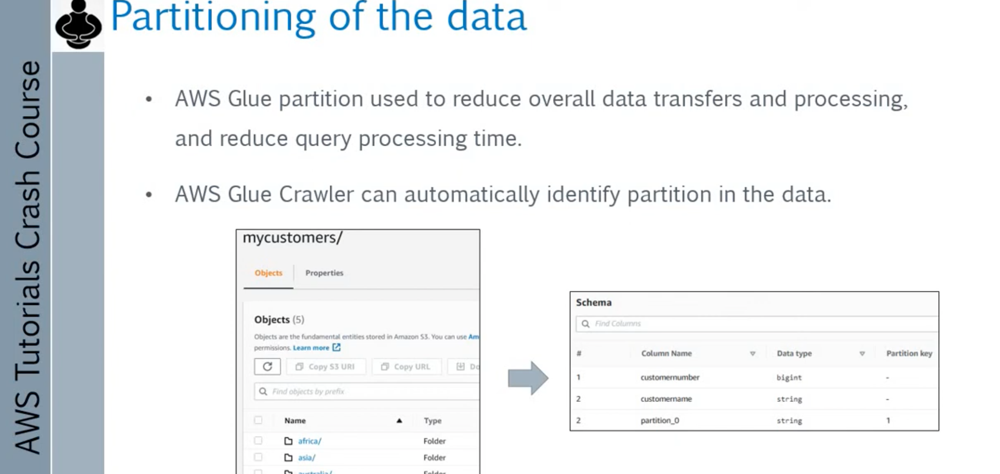
-   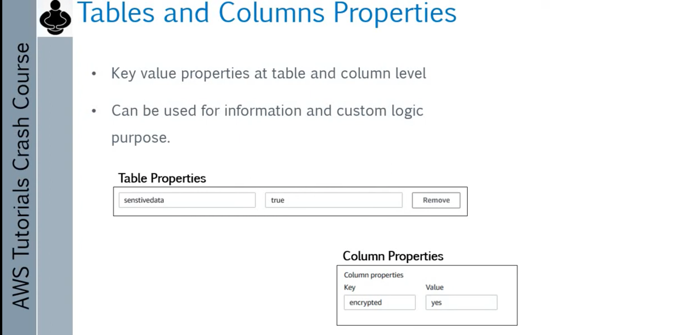
-   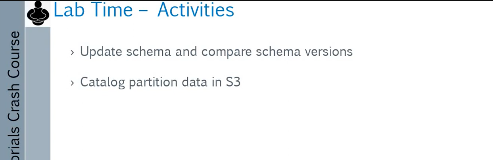

#### Features of Data Catalog

-   **Table Schema Versioning**

    -   Creates a schema version when cataloging data.
    -   New schema version created each time schema changes (fields added/removed, data type changes).
    -   Maintains history of schema changes.
    -   Allows comparison of schema versions.
    -   Provides visibility into schema change history and lineage.

-   **Partitioning of Data**

    -   Partitions data based on criteria like customers, date, time, year, month, region.
    -   Improves data processing and query performance by scanning specific data partitions.
    -   Automatically identifies data partitioning during crawling.
    -   Allows configuration of partition keys when cataloging data.

-   **Custom Properties for Tables and Columns**
    -   Allows association of custom properties with tables and columns.
    -   Useful for attaching information used in business logic.
    -   Custom properties can be used to make decisions in custom business logic scenarios.

#### Lab Steps

-   **Changing Table Schema**

    -   Logged into AWS console using us-east region and an IAM user with administrative privileges.
    -   Modified an existing RDS table by adding a new column and updating data.
    -   Ran the crawler to detect and update the schema change in the catalog.
    -   Verified schema versioning and comparison in the catalog.

-   **Configuring Crawler Permissions**

    -   Identified and resolved issues with crawler permissions for accessing S3 buckets.
    -   Provided additional permissions to the crawler using a JSON policy.

-   **Cataloging Partitioned Data**

    -   Uploaded partitioned data (based on years) to an S3 bucket.
    -   Configured and ran a crawler to catalog the partitioned data.
    -   Verified the partitioning information in the data catalog.

-   **Configuring Table and Column Properties**
    -   Added custom properties to a table in the data catalog.
    -   Added custom properties to columns in the table.
    -   Demonstrated the use of custom properties for tables and columns.

---

<a href="https://www.youtube.com/watch?v=QQb_HOmn3MU&list=PL8RIJKpVAN1euv-WAoggrdI_wX3zeb9uR&index=6">Glue Job and Glue Studio</a>

-   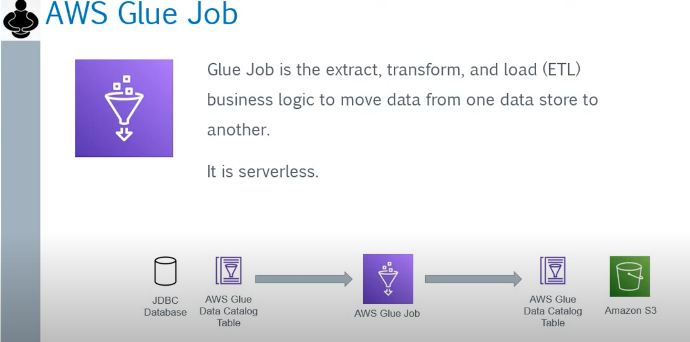
-   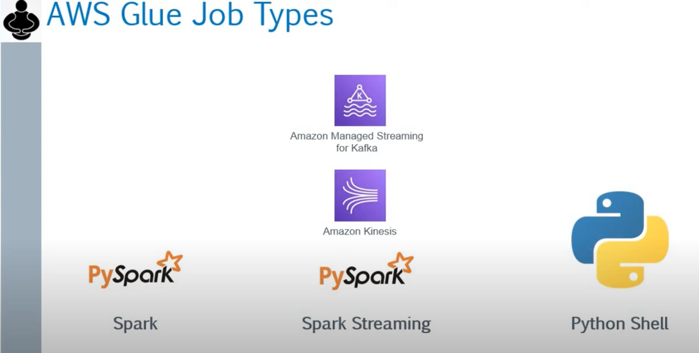
-   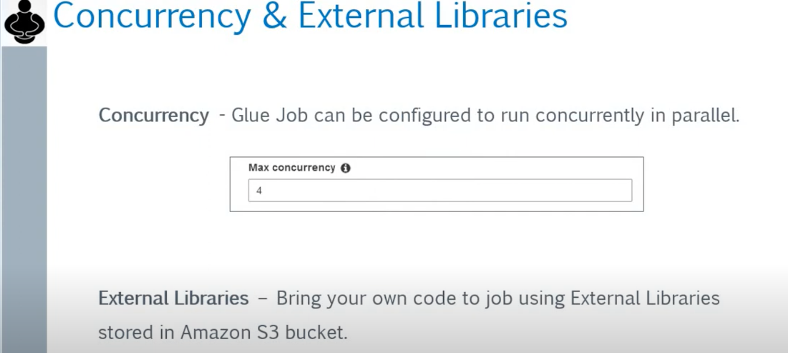
-   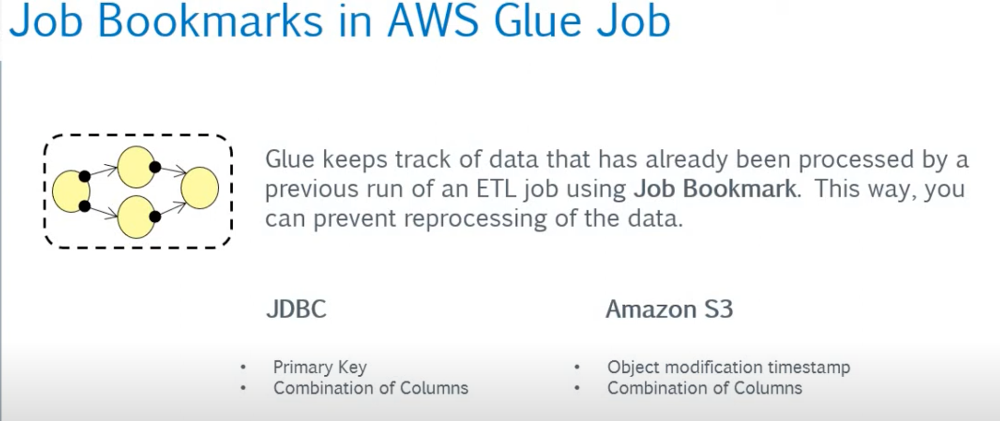
-   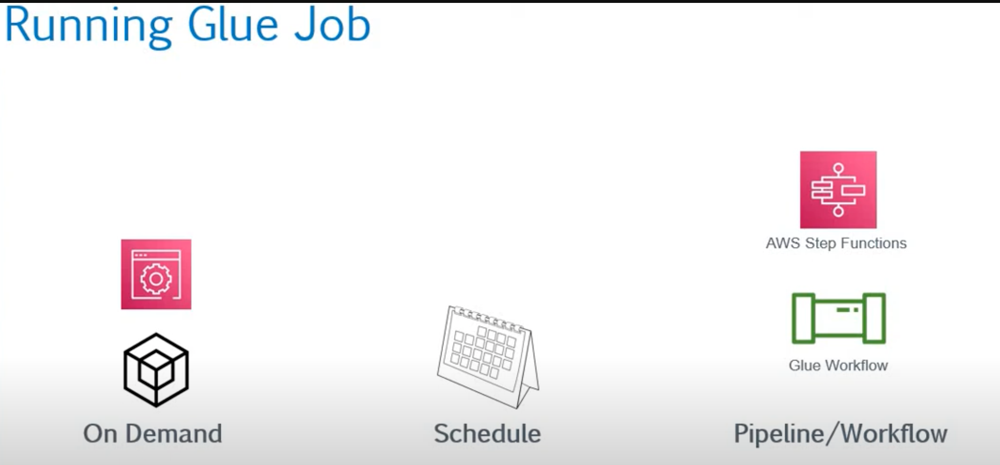
-   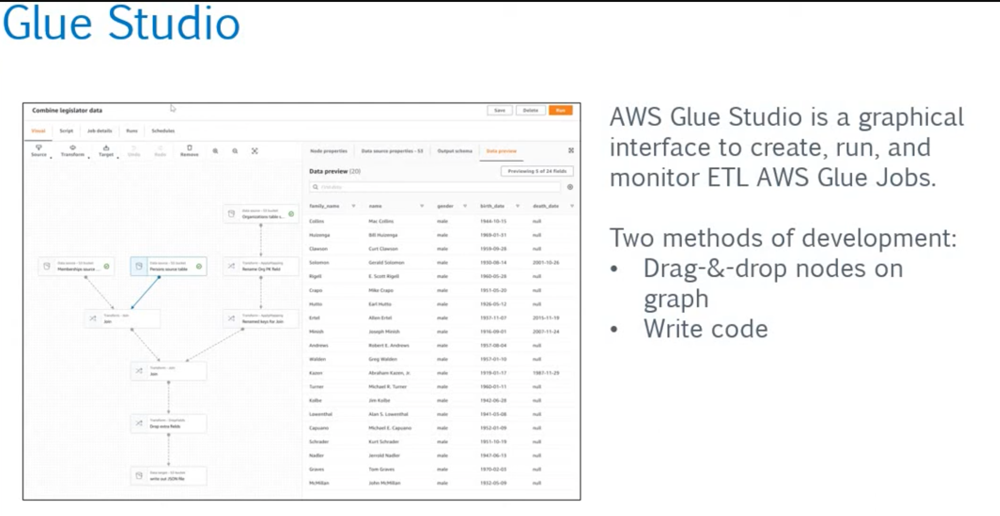
-   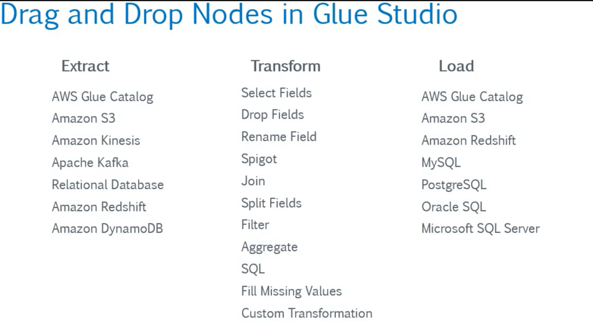

-   **AWS Glue Job Overview**

    -   **Definition**
        -   ETL (Extract, Transform, Load) job for moving data between sources.
        -   Handles data extraction, transformation, and loading into target locations within a data platform.
    -   **Serverless Nature**
        -   No need to provision servers or resources.
        -   Simply create, configure, and run the job.

-   **Types of AWS Glue Jobs**

    -   **Spark Job**: Uses Apache Spark for processing.
    -   **Spark Streaming Job**: For handling streaming data from sources like social media or IoT platforms.
    -   **Python Shell Script Job**: Utilizes Python modules and libraries for data processing.

-   **Job Parallelism and Concurrency**

    -   **Running Jobs in Parallel**: Configure maximum concurrency to run multiple instances simultaneously.
    -   **Using External Libraries**: Python libraries can be added by placing them in an S3 bucket and configuring the job to use them.

-   **Incremental Data Processing**

    -   **Job Bookmarks**
        -   Avoid reprocessing old data.
        -   Use primary keys or columns for JDBC sources.
        -   Use object modification timestamps for Amazon S3.

-   **Job Execution Methods**

    -   **On-Demand Execution**
        -   Run from the AWS console or via API calls.
    -   **Scheduled Execution**
        -   Configure to run at specific intervals.
    -   **Pipeline or Workflow Execution**
        -   Orchestrate multiple Glue jobs and other entities like crawlers.
        -   Use AWS Step Functions or Glue workflows for complex pipelines.

-   **AWS Glue Studio**

    -   **Features**
        -   Easy-to-use graphical interface for job creation, execution, and monitoring.
    -   **Methods for Job Creation**
        -   Drag-and-Drop method for visual ETL operations configuration.
        -   Code-based method using Spark or Python Shell.
    -   **Types of Activities**
        -   **Extraction Activities**: Nodes for extracting data from various sources like JDBC endpoints, S3, Kinesis, and DynamoDB.
        -   **Transformation Activities**: Operations for filtering, aggregating, joining, and custom transformations.
        -   **Load Activities**: Nodes for writing data to targets like S3, Redshift, or relational databases.

-   **Hands-On Example: Creating a Glue Job Using Glue Studio**
    -   **Setup Steps**
        -   Create an IAM role with necessary permissions.
        -   Configure Lake Formation permissions for reading source data.
        -   Create an S3 folder for writing output data.
    -   **Job Creation in Glue Studio**
        -   **Source Configuration**
            -   Define source database and table.
        -   **Transformation**
            -   Apply select fields transformation.
        -   **Target Configuration**
            -   Define target S3 location and output format.
            -   Enable cataloging of output data.
    -   **Job Execution**
        -   Run the job and monitor its execution.
        -   Verify output data in Lake Formation and S3.

---

<a href="https://www.youtube.com/watch?v=QX8stvTQ57o&list=PL8RIJKpVAN1euv-WAoggrdI_wX3zeb9uR&index=7">Glue Workflow</a>

-   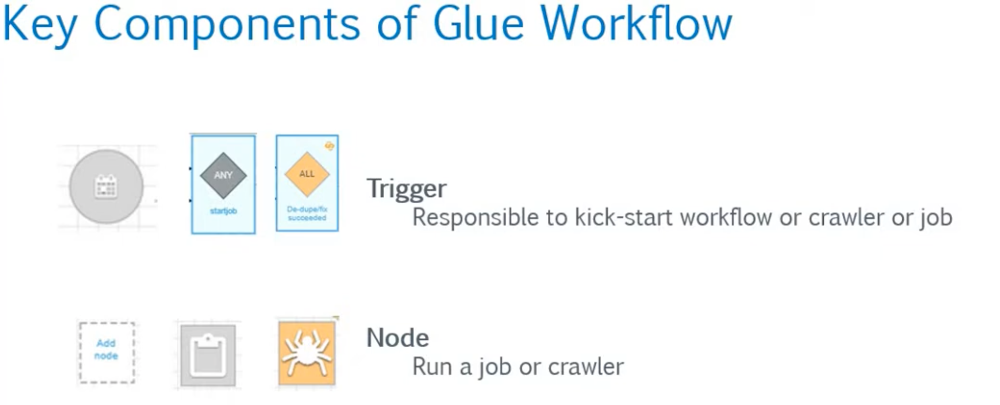
-   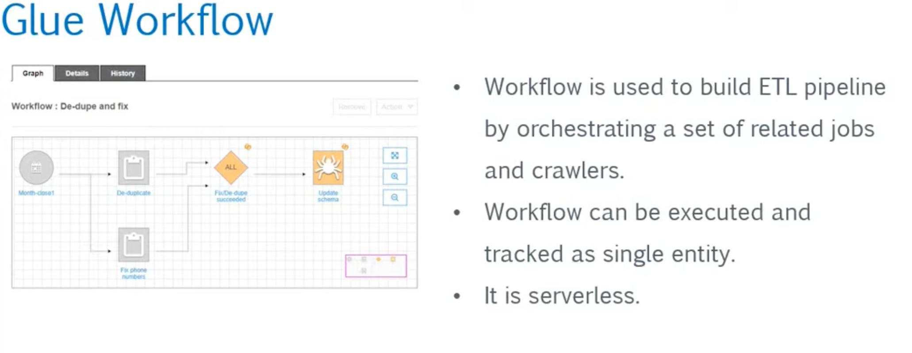

-   **AWS Glue Workflow Overview**

    -   AWS Glue Workflow is a method to create a pipeline to orchestrate Glue crawlers and/or Glue jobs.
    -   It helps to execute multiple Glue crawlers or jobs in a specific sequence to run a pipeline.
    -   Glue Workflow can only orchestrate Glue jobs and Glue crawlers, not other AWS services.
    -   **Monitoring**
        -   The workflow runs as a single entity and allows monitoring of the pipeline's progress.
        -   You can view the sequence in which the flow is being executed.
    -   **Serverless**
        -   Glue Workflow is a fully serverless service.
        -   No need to provision or configure any compute capacity.

-   **Main Components of Glue Workflow**

    -   **Triggers**
        -   Responsible for starting a workflow, Glue job, or Glue crawler.
        -   Can be initiated in three ways:
            -   **On-demand**: Manually started.
            -   **Event-based**: Triggered by an event.
            -   **Scheduled**: Based on a predefined schedule.
    -   **Nodes**
        -   Responsible for running the actual Glue job or crawler.
        -   Triggers initiate the workflow or tasks, but nodes execute the crawlers or jobs.

-   **Pipeline Execution Flow**

    -   Start the workflow with a trigger that can be based on schedule, event, or manual action.
    -   The workflow then calls a node, which runs either a Glue job or a crawler.
    -   After execution, the node notifies the trigger to proceed based on success or failure.
    -   **Event-based Triggers**: In the middle of a workflow, triggers are only based on events, such as the completion of a job or crawler.
        -   **Choices for Event Triggers**:
            -   **Any Event**: Trigger starts when any previous step finishes.
            -   **All Events**: Trigger starts only when all previous steps are completed.
    -   Branching and merging of workflows are possible.
        -   Multiple nodes (jobs or crawlers) can run in parallel and converge based on event triggers.

-   **Workflow Properties**

    -   Jobs running under a Glue Workflow can share states using Glue Workflow properties.
    -   Properties are key-value pairs accessible to all jobs in the workflow.
        -   Jobs can read and update these properties, enabling them to communicate and share data.
        -   Example: A job writes output to an S3 location and updates a property with this information, which can be used by subsequent jobs.

-   **Example Workflow**

    -   The workflow starts with an **RDS Crawler** that catalogs data from an RDS table.
    -   After the crawler completes, an **RDS to S3 Glue Job** runs, reading data from RDS and writing it to an S3 bucket.
    -   The workflow ensures the crawler runs first, followed by the Glue job in sequence.

-   **Complex Pipeline Configuration**

    -   **Parallel Execution**: Multiple nodes (jobs or crawlers) can run simultaneously.
    -   **Event-Based Triggering**: After parallel tasks, triggers can wait for all or any tasks to finish before proceeding to the next step.

-   **Lab Setup**
    -   Clean up previous output and tables.
    -   Create a Glue Workflow to run the RDS Crawler and Glue Job in sequence.
    -   Monitor the progress and verify output in the S3 bucket and Glue catalog.

---

<a href="https://www.youtube.com/watch?v=YhTyxIwkd7w&list=PL8RIJKpVAN1euv-WAoggrdI_wX3zeb9uR&index=8">Glue Advanced Topics</a>

-   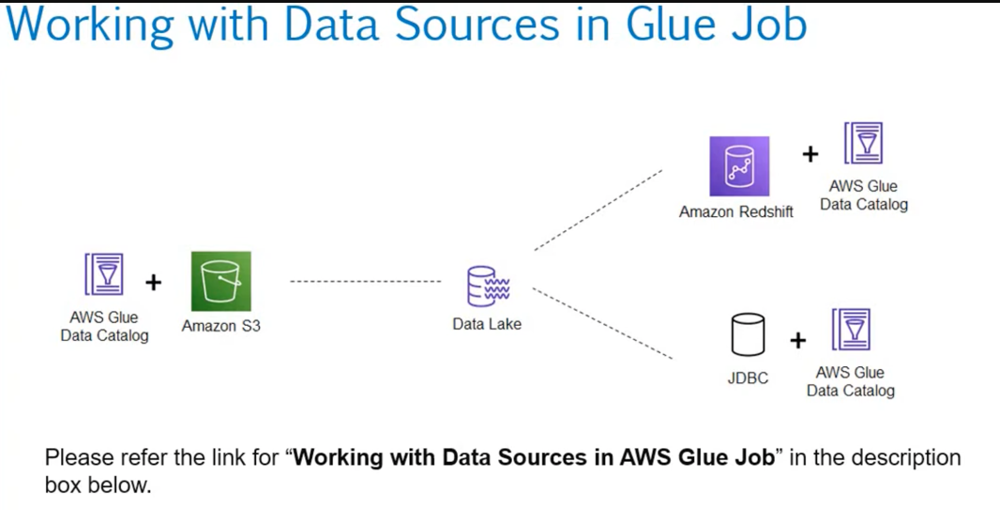
-   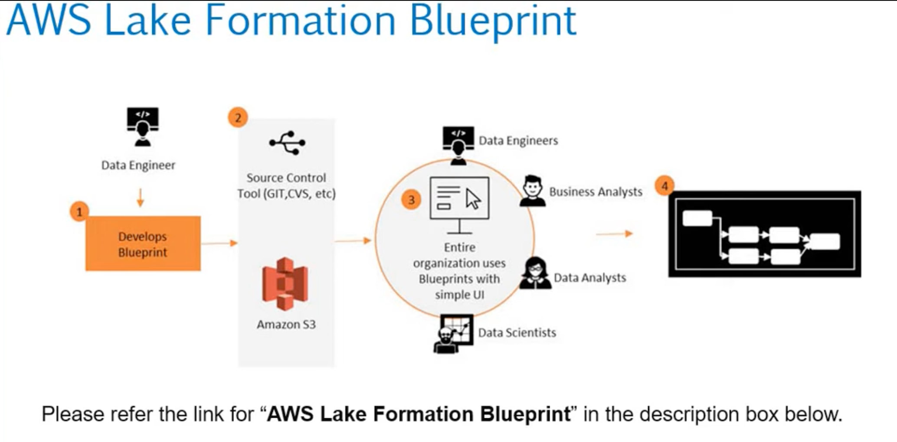
-   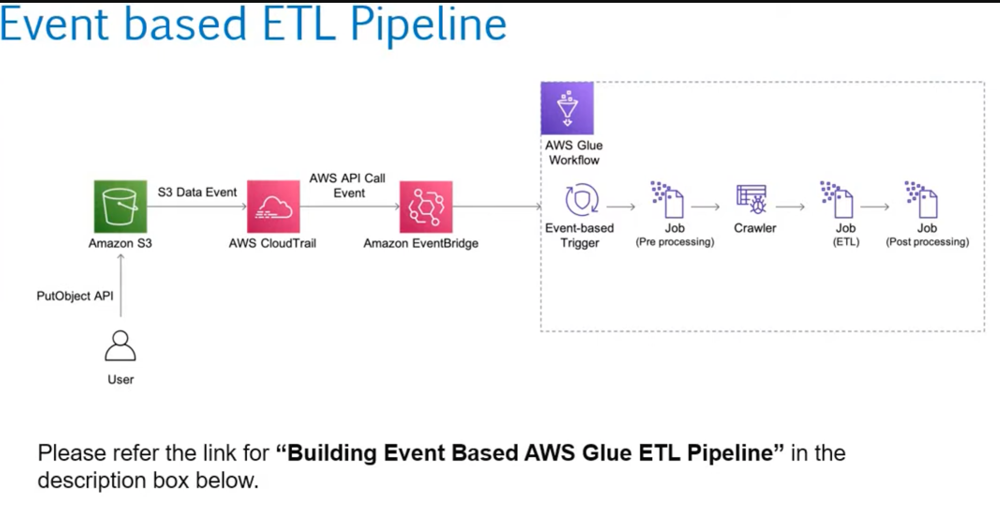
-   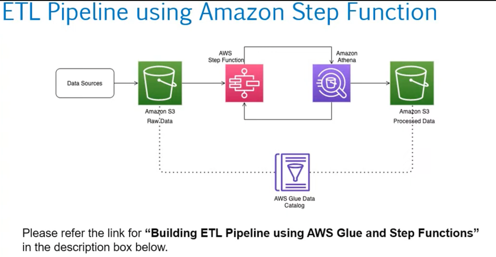
-   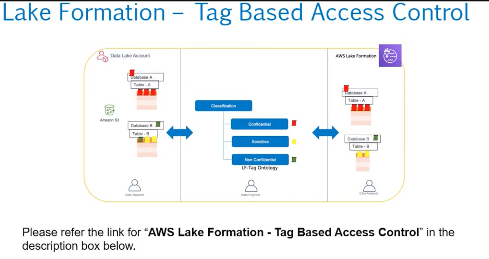
-   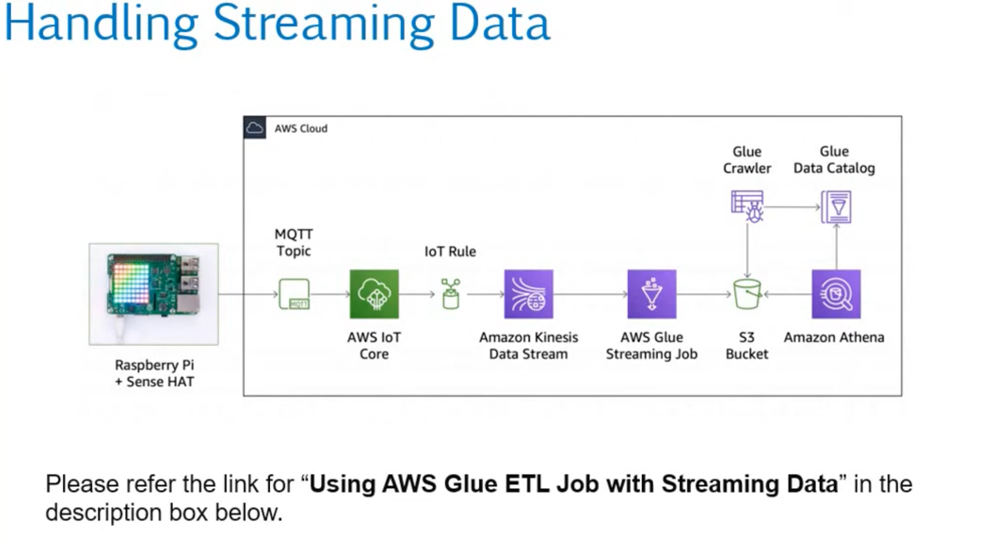
-   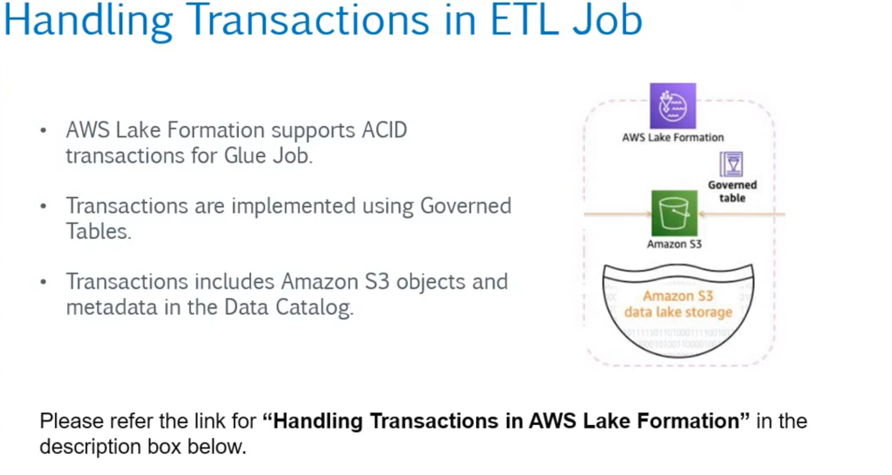
-   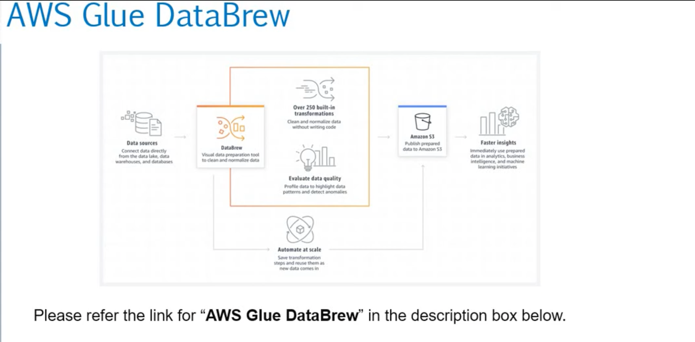

-   **Working with Glue Jobs and Data Sources**
    -   Glue jobs work with various data sources:
        -   Relational databases
        -   Redshift
        -   S3
        -   DynamoDB
    -   Best practices for working with data sources are covered in a video (link in description).
-   **Creating ETL Pipelines in Glue**
    -   Three primary methods to create ETL pipelines:
        -   **Event-based pipelines**
        -   **Glue workflows** (discussed in previous modules)
        -   **Amazon Step Functions**
            -   Video available on building ETL pipelines using Step Functions (link in description).
-   **Event-Based ETL Pipelines**

    -   Orchestrate Glue jobs and crawlers using event-based mechanisms.
    -   End-to-end pipeline triggered by events (link in description).

-   **Amazon Step Functions for Pipelines**

    -   Step Functions can be used to orchestrate Glue jobs and crawlers.
    -   Video available on this topic (link in description).

-   **Tag-Based Access Control**

    -   Two methods of access control:
        -   **Reactive method**: Grant access on demand (e.g., user requests access to a table).
        -   **Proactive method**: Define tags that are associated with access control.
            -   Example: Assign a security tag to control access permissions.
            -   Once the data catalog is created, it is associated with tags, and access is automatically managed.
        -   More details in the video (link in description).

-   **Custom Classifiers**

    -   Glue crawlers use classifiers to identify schema and catalog data.
    -   Out-of-box classifiers may not always work; custom classifiers are needed for:
        -   XML
        -   JSON
        -   CSV
        -   Grok patterns
    -   Learn how to define custom classifiers (link in description).

-   **Glue Workflows**

    -   Orchestrate Glue jobs and crawlers using:
        -   **Workflow designer** (drag-and-drop approach).
        -   **Templates** (use AWS Lake Formation blueprint or custom templates).
    -   Learn more about creating Glue workflows with templates (link in description).

-   **Handling Streaming Data with Glue**
    -   Glue can handle streaming data from sources like:
        -   IoT devices
        -   Social media
    -   Glue integrates with Kinesis Data Streams for data ingestion and performs ETL on the streaming data.
    -   Learn how to handle streaming data with Glue (link in description).

